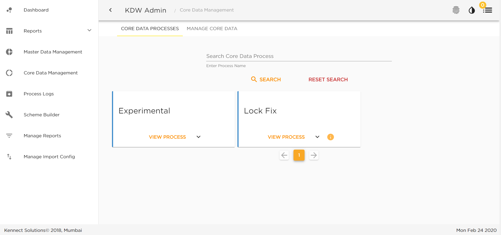

# Creating new journey (walkthrough)
You can create a journey by creating a folder named xyz in the tenant_name/journies inside the dw-journey-spaces repo. Look for other journies in there to learn.


1. Add your public access key to your account
2. Clone repository: 
git clone git@github.com:medstudio/dw-journey-spaces.git

3. Create some csv files in ur pc and put below data into them. (Please create more data by from your own imagination by changing month and brand and putting imaginary sale numbers, ame imaginary employees)

``sales.csv``
```
    emp_id,brand,month,units,value,target
    e1,Brand_1,Jan-2020,1000,50000,60000
    e1,Brand_2,Jan-2020,1000,50000,60000
```

``emp_list.csv``


```
    emp_id,position_code,name
    e1,mumbai1,Sameer Mango
    e2,pune1,Jack Panda
```

## STEPS

## 1. **MANIFEST.JSON**
Your goal is to Create an automation journey which puts the following data into our system as a collection.
    
    For hints, look at /pralok/journeys/ninja_hattori_sales_data_909
    
    
    a. In the dw-journey-spaces repository, create a Journey test-client-folder

        i. Find the domain of your test client (example: pralok)
        ii. Go into dw-journey-spaces clone in your computer and create a new folder in 
            /pralok/journeys 
            and name the folder with a unique codename, 
            example: sales_automation_155

        iii. Now Create a manifest.json file into this folder and **declare** following stuff 
            name (must match the foldername)
            displayname
            (and many fields as stated in manifest.json of ninja_hattori_sales_data_909 )
        
    
    b. In the journey manifest declare the input files and their expected fields as following
    ```
        "inputConfig": [
            {
                "id": "in_file_emp_list",
                "name": "in_file_emp_list",
                "type": "file",
                "fields": [
                    "emp_id",
                    "position_code",
                    "name"
                ],
                "upload": true,
                "columnParser": {
                    "emp_id": "string"
                }
            },
             {
                "id": "in_sales",
                "name": "in_sales",
                "type": "file",
                "fields": [
                   "emp_id",
                   "brand",
                   "month",
                   "units",
                   "value",
                   "target"
                ],
                "upload": true,
                "columnParser": {
                    "emp_id": "string",
                    "value": "number",
                    "units": "number",
                    "target": "number"
                }
            }
        ],
    ```
    c. Also declare a field in manifest as  ``"outputCollectionNames"`` this tells how/where the result will be stored in the system. (you can have many)

    ```
        "outputCollectionNames": [
            "raw_emp_list",
            "emp_sales_by_month"
        ]
    ``` 

## 2. **PROCESS.JS**
Create a process.js file into this folder and copy following boilerplate

```


module.exports = async function (formulas, inputParams) {
    return [ 
        // array of all parts of the journey

        async()=>{
            // part 1 of the journey
        },

        async()=>{
            // part 2 of journey 
        }

        // you can have many parts of the journey
        // in each part you can use formulas

    ]
}

```
now let's use some formulas and transform the data before storing it.
add below lines to first part
```
formulas.addKeysWithFormula("in_sales", "raw_emp_list", [
    { 
        newKeySet: ['created_on','joined_on'], 
        keys: 'row',
        formula: (row)=>{
            return {
                created_on: new Date().toString(),
                joined_on: (row.joined_on? row.joined_on : row.new Date().toString())
            }
        },  
    },
])
```
now let's use some formulas and transform the data before storing it.
add below lines to second part
```
formulas.addKeysWithFormula("in_file_emp_list", "emp_sales_by_month", [
    { 
        newKeySet: ['created_on','joined_on'], 
        keys: 'row',
        formula: (row)=>{
            return {
                created_on: new Date().toString(),
                joined_on: (row.joined_on? row.joined_on : row.new Date().toString())
            }
        },  
    },
])
```
Try using some more formulas from [Formulas docs](/journeys/formulas.html#formulas-docs)

## 3. **PUSHING THE JOURNEY**
use git to commit your changes in dw-journey-spaces, 
stage the changes, commit them and push
```
git add . 
git commit -m "created my first journey"
git push origin master
```

This will allow you to see the journey in 

    https://dw.kennectweb.com 

login with credentials provided to you for test client

then click on ``'Core Data Management'`` in a sidebar which opens from ``top left arrow``.

You will be able to view your journey and invoke it by clicking on ``view process``.




Upload the files you created into this and run the journey.

After the journey is complete, you may connect to the client-database and see the output colelctions and alternatively, by clicking on teh tab named  ``MANAGE CORE DATA``.

Verify that you see the latest data uploaded. Try running the journey with a new set of data and check if you see new data in output collections.